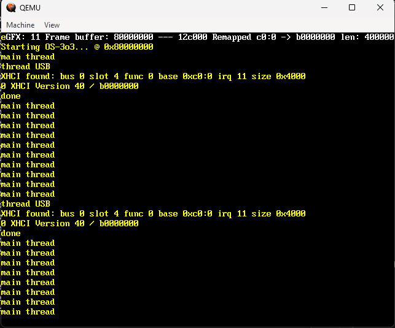

                                 OS-3o3

              The authors disclaim copyright to this software.

                             PUBLIC DOMAIN


                           code name : 32gears

                                  |||

                            https://3o3.org

                        
# The OS-3o3 public domain Operating System



## License

See individual files for public domain dedication.

The files in ./non-free/ folder are Copyrighted, these files are not public domain. 

### Quick start on Debian host :
```
sudo apt install lld llvm clang git qemu-system
git config http.postBuffer 524288000
git clone https://github.com/3-o-3/3o3.git
cd 3o3
mkdir bin
cd bin
sh ../build.cmd .. all
cd ..
codium .
``` 


REFERENCES :
------------

Mips:

http://plasmacpu.no-ip.org/

https://opencores.org/projects/plasma/tools


Arm:

https://github.com/rsta2/circle/

https://www.cl.cam.ac.uk/projects/raspberrypi/tutorials/os/

https://github.com/Chadderz121/csud

https://github.com/isometimes/rpi4-osdev

https://github.com/s-matyukevich/raspberry-pi-os/issues/237

https://github.com/umanovskis/baremetal-arm

https://developer.arm.com/documentation/den0013/d/ARM-Processor-Modes-and-Registers/Registers/Coprocessor-15

https://github.com/BrianSidebotham/arm-tutorial-rpi/

https://github.com/LdB-ECM/Raspberry-Pi/

https://github.com/AZO234/RaspberryPi_BareMetal/


x86:

https://www.youtube.com/watch?v=FaILnmUYS_U

https://github.com/zment4/tetris-os

https://uefi.org/sites/default/files/resources/UEFI_Spec_2_9_2021_03_18.pdf

https://raw.githubusercontent.com/BlankOn/ovmf-blobs/master/bios32.bin

https://github.com/clearlinux/common/blob/master/OVMF.fd

https://deac-ams.dl.sourceforge.net/project/mingw-w64/Toolchains%20targetting%20Win64/Personal%20Builds/mingw-builds/8.1.0/threads-win32/seh/x86_64-8.1.0-release-win32-seh-rt_v6-rev0.7z

https://pdos.org

https://github.com/egormkn/MBR-Boot-Manager

https://github.com/jdah

http://t3x.org/subc/index.html

http://collapseos.org/

https://sourceforge.net/projects/mingw/files/OldFiles/w32api-3.13/

https://github.com/Immediate-Mode-UI/Nuklear

https://github.com/nothings/stb

https://www.libtom.net/

https://github.com/robertapengelly/dosfstools

https://github.com/inferno-os/inferno-os


USB:

https://github.com/managarm/managarm

https://github.com/fysnet/FYSOS/tree/master/main/usb/

https://github.com/uchan-nos/mikanos/tree/master/kernel/usb

https://github.com/cherry-embedded/CherryUSB/

https://github.com/awkrail/tiny_xHCI/

https://github.com/hathach/tinyusb

https://github.com/SkyRzn/xhci/

https://www.beyondlogic.org/usbnutshell/

https://www.beyondlogic.org/primer-usb-c-connector/


MISC:

https://www.youtube.com/@javidx9/videos
